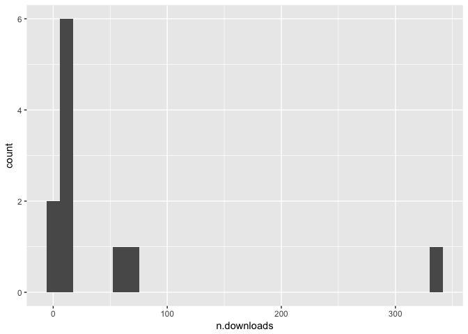

Zip downloads
================
Rick Gilmore
2017-06-09 08:19:45

Purpose
-------

Analyze download logs of zip files for 2017-06-09 Databrary Advisory Board meeting.

Preliminaries
-------------

``` r
zipdown <- read.csv("analysis/csv/databrary-zip-downloads.csv")
str(zipdown)
```

    ## 'data.frame':    976 obs. of  7 variables:
    ##  $ downloads : int  3 1 1 1 1 2 1 1 1 1 ...
    ##  $ vol.id    : int  1 1 1 1 2 4 4 4 4 4 ...
    ##  $ vol.name  : Factor w/ 66 levels "2016 Background",..: 44 44 44 44 44 22 22 22 22 22 ...
    ##  $ asset.id  : int  10068 15663 9224 9578 9 39 15 27 35 36 ...
    ##  $ asset.name: Factor w/ 220 levels "01.18.17-01",..: 196 76 195 82 140 147 147 147 147 147 ...
    ##  $ shared    : Factor w/ 2 levels "no","yes": 2 2 2 2 2 2 2 2 2 2 ...
    ##  $ X         : Factor w/ 2 levels "","and Academic Leadership": 1 1 1 1 1 1 1 1 1 1 ...

Table of downloads by volume
----------------------------

``` r
zipdown %>% 
  filter(shared == "yes") %>%
  group_by(vol.name, vol.id) %>% 
  summarise(n.downloads = sum(downloads)) %>%
  arrange(desc(n.downloads)) %>%
  knitr::kable()
```

| vol.name                                                    |  vol.id|  n.downloads|
|:------------------------------------------------------------|-------:|------------:|
| CAFE                                                        |      30|          341|
| MetroBaby                                                   |       8|           65|
| None                                                        |     239|           56|
| Gesell                                                      |      70|           16|
| FF-NSF                                                      |     108|           13|
| None                                                        |     112|           13|
| ET CrawlWalk (incl. motion tracking)                        |       4|            8|
| Perceptual staircase for expression                         |     272|            8|
| None                                                        |       1|            6|
| None                                                        |     303|            5|
| Sticker Rich                                                |     165|            5|
| 40 head camera clips object play                            |      42|            4|
| False Belief                                                |      98|            4|
| Mom Advice                                                  |     193|            4|
| Playground                                                  |       9|            4|
| Sample play                                                 |     235|            4|
| SEEDLingS                                                   |     228|            4|
| BridgesCrawlWalk                                            |       5|            3|
| Magnet imitation task demonstration                         |      40|            3|
| Pupillary Contagion in Infancy                              |     214|            3|
| Belief Understanding Examples                               |     241|            2|
| Clay Topos                                                  |     297|            2|
| Development of social attention                             |      36|            2|
| ET Baby Mom                                                 |     123|            2|
| Faces in early visual environments of infants               |      99|            2|
| natural-scene-statistics-across-culture (Locomotion Coding) |      81|            2|
| Providence                                                  |      90|            2|
| SlopesMonograph                                             |      28|            2|
| Visual search and attention to faces                        |      37|            2|
| Cogsci2016:ActiveLearning                                   |     273|            1|
| gilmore-rettke-2003                                         |      31|            1|
| LedgeWedge                                                  |       7|            1|
| Messinger12                                                 |      15|            1|
| None                                                        |       2|            1|
| None                                                        |      44|            1|
| None                                                        |      45|            1|
| None                                                        |      53|            1|
| None                                                        |      62|            1|
| None                                                        |      65|            1|
| None                                                        |      86|            1|
| None                                                        |     270|            1|
| Number as cognitive technology                              |      35|            1|
| Piraḥ                                                       |      10|            1|
| Reaching and looking measures of Gestalt perception         |      46|            1|
| Representing Exact Number with Mental Abacus                |      33|            1|
| Science scale errors                                        |      61|            1|

Bar plot
--------

``` r
zipdown %>%
  filter(shared == "yes") %>%
  group_by(vol.name, vol.id) %>% 
  summarise(n.downloads = sum(downloads)) %>%
  filter(n.downloads >= 5) %>%
  arrange(desc(n.downloads)) ->
  downloads.gt5

downloads.gt5 %>%
  ggplot() +
    aes(x=n.downloads) +
    geom_histogram()
```

    ## `stat_bin()` using `bins = 30`. Pick better value with `binwidth`.



``` r
zipdown %>%
  filter(shared == "yes") %>%
  summarise(n.downloads = sum(downloads)) ->
  total.shared.downloads
```

There were 604 downloads of shared volumes from 2015-07-15 to 2017-06-08.
